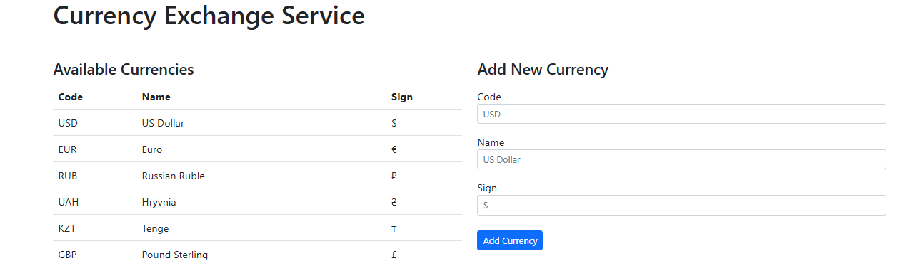
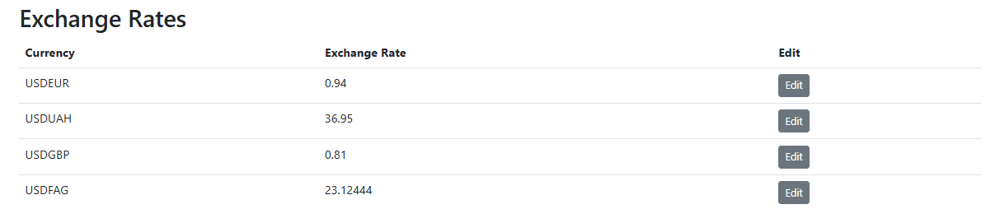
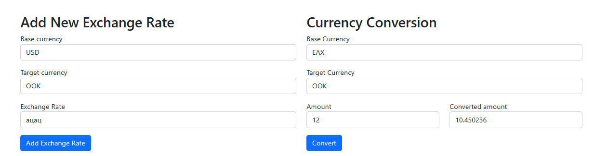

# Currency Exchange API

[](https://adoptium.net/)
[](https://maven.apache.org/)
[](https://www.docker.com/)

## Описание

Проект “Обмен валют” # REST API для описания валют и обменных курсов. Позволяет просматривать и редактировать списки валют и обменных курсов, и совершать расчёт конвертации произвольных сумм из одной валюты в другую.  Веб-интерфейс для проекта не подразумевается.

## Страница работы rest api с фронтендом




## Технологии

| Компонент | Технология |
|-----------|------------|
| **Бэкенд** | Java 21, Jakarta Servlet 6.0, JDBC |
| **База данных** | PostgreSQL 15 |
| **Пул соединений** | HikariCP |
| **JSON** | Jackson |
| **Маппинг** | MapStruct |
| **Контейнеризация** | Docker, Docker Compose |
| **Веб-сервер** | Tomcat 10.1, Nginx |


## 🚀 Запуск

### Деплой

```bash
#for docker
apt update && apt upgrade -y
curl -fsSL https://get.docker.com -o get-docker.sh
sh get-docker.sh
#for docker compose
apt install docker-compose-plugin -y

#for project
git clone https://github.com/Danil6789/exchanger.git
cd exchanger
mvn clean package
docker compose up -d
```
## 📋 API Эндпоинты

| Метод | URL | Описание |
|-------|-----|----------|
| `GET` | `/currencies` | Список всех валют |
| `GET` | `/currency/USD` | Конкретная валюта |
| `POST` | `/currencies` | Добавить валюту |
| `GET` | `/exchangeRates` | Список всех курсов |
| `GET` | `/exchangeRate/USDEUR` | Курс для пары |
| `POST` | `/exchangeRates` | Добавить курс |
| `PATCH` | `/exchangeRate/USDEUR` | Обновить курс |
| `GET` | `/exchange?from=USD&to=EUR&amount=100` | Конвертация |

---

## 📥 Пример запроса и ответа

**Запрос:**
```http
GET /currencies
```
ответ
```json
[
  {
    "id": 1,
    "code": "USD",
    "name": "US Dollar",
    "sign": "$"
  },
  {
    "id": 2,
    "code": "EUR",
    "name": "Euro",
    "sign": "€"
  }
]
```
## 🔍 Алгоритм поиска курса

При конвертации из валюты **A** в валюту **B** курс ищется в 3 этапа:

| Этап | Условие | Формула | Пример (USD → EUR) |
|------|---------|---------|-------------------|
| **1. Прямая пара** | Есть курс A→B | `rate = AB` | USD→EUR = 0.92 |
| **2. Обратная пара** | Есть курс B→A | `rate = 1 / BA` | EUR→USD = 1.09 → USD→EUR = 1 / 1.09 = 0.917 |
| **3. Кросс-курс через USD** | Есть USD→A и USD→B | `rate = USD→B / USD→A` | USD→EUR = 0.92, USD→RUB = 100 → RUB→EUR = 0.92 / 100 = 0.0092 |

Если ни один из сценариев не сработал — возвращается ошибка `404 Not Found`.

